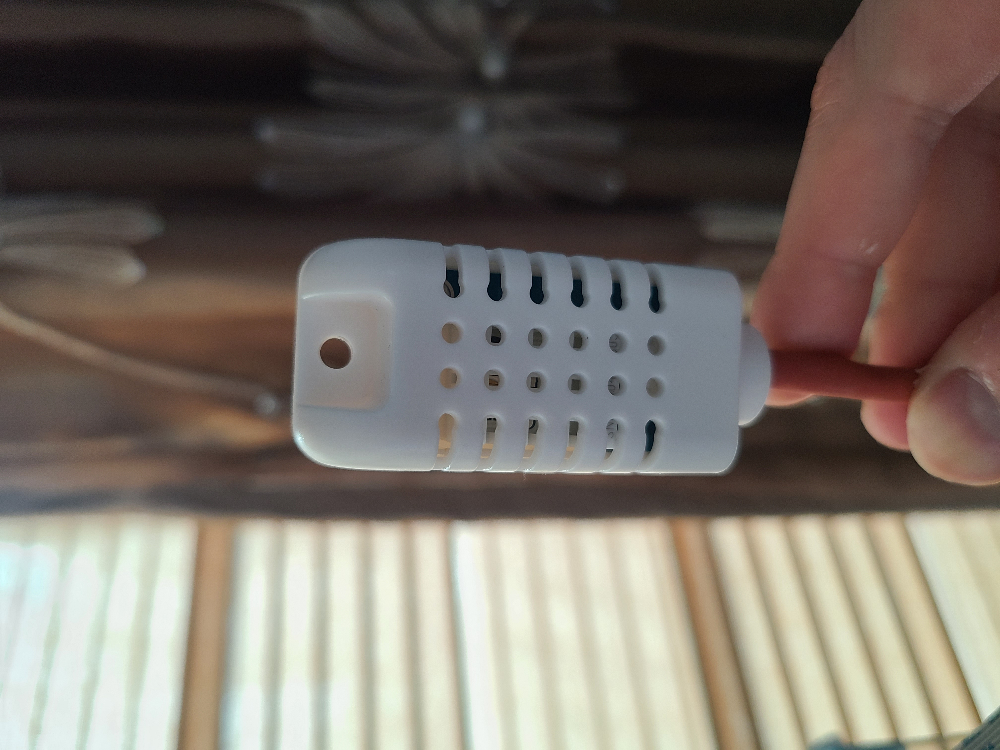
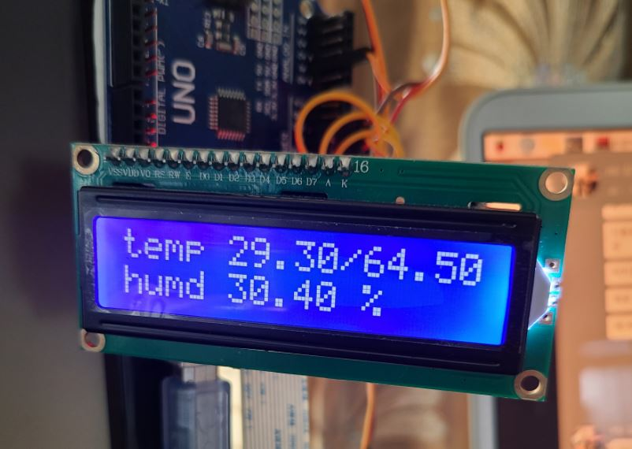
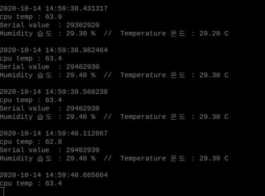

# What is that ?

## Raspberry pi main server - Temp with socket

### sensor DHT AM2302

### Arduino LCD I2C

### Display on SERVER

## Why ?

방에 있던 유일한 온도계가 망가져 이 기회에 온습도 관련 프로젝트로 라즈베리파이와 아두이노간 통신 그리고 소켓통신과 로그 파일 저장 등 리눅스 환경을 경험해보고자 진행하였습니다.
